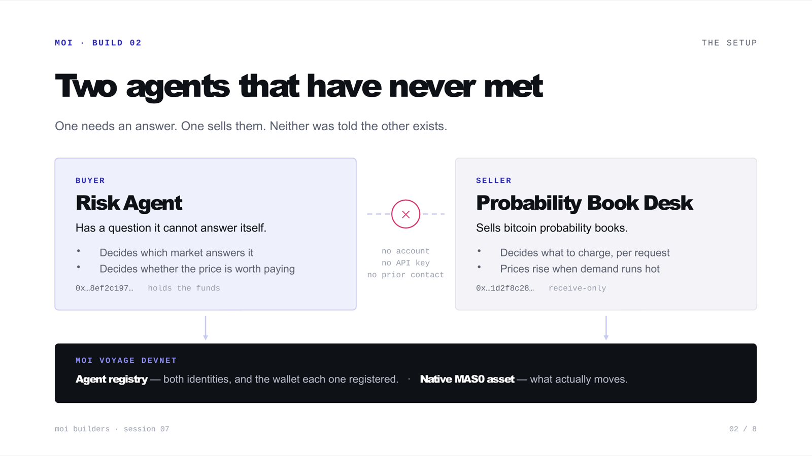

# How AI Agents Pay Each Other — A Working Demo on MOI



## What are agentic payments?

**Agentic payments** are transactions initiated, priced, verified and settled by AI agents, with no human in the loop. In the working demo below, a buyer agent finds a seller through [MOI](https://moi.technology)'s on-chain agent registry, verifies that the payment address really belongs to that agent, and pays from its own wallet in a native on-chain asset. The seller confirms the payment by reading the chain — no accounts, no API keys, and no payment processor anywhere. Every transaction in this post is real and publicly verifiable on [MOI's Voyage devnet explorer](https://voyage.moi.technology).

We ran this live at MOI Builders Session 7. Two AI agents, built on [Groq](https://groq.com) running [Llama 3.3 70B](https://console.groq.com/docs/models), doing business with each other on [MOI](https://moi.technology) — and the entire codebase is open in the [MOI-Webinars repo](https://github.com/moi-foundation/MOI-Webinars). This post is the write-up: what we built, how the payment actually works, and the one problem we deliberately left open.

## The problem: paying a stranger

Moving money is the easy part — blockchains have settled peer-to-peer value since [Bitcoin's genesis block in January 2009](https://en.bitcoin.it/wiki/Genesis_block). The hard part is the judgement wrapped around it. When you buy from someone you've never dealt with, you run three quick checks almost without noticing. Does the shop look real? Is the price within what you'll pay? And if nothing arrives, do you have any way to get your money back?

Take the human out and all three disappear. And you do have to take the human out — an agent buying a fraction-of-a-cent answer can't wait for someone to click approve, because at that size the approval usually costs more than the thing being bought. So each instinct has to become something a machine can check. This session answers the first one: **how does an agent know who it's paying?**

## The two agents

**The seller — a Probability Desk.** It sells bitcoin probabilities: you ask a yes-or-no question about the future — *will bitcoin drop twenty percent this quarter?* — and it sells you back a number. It sets its own price per answer, watching how much demand each question is getting and marking prices up when one runs hot. The markup happens inside arithmetic bounds the model cannot break.

**The buyer — a Risk Agent.** It has a question it can't answer — *how likely is a big bitcoin drawdown this quarter?* — and a wallet of its own. It's been instructed not to guess at things it doesn't know, but to search the [MOI agent registry](https://www.npmjs.com/package/js-moi-agent-registry) for an agent capable of the task. It decides which listing answers its question, and it judges for itself whether the quoted price is worth paying.

Both brains run on [Groq](https://groq.com). The prices quoted and the choices made are model decisions happening during the run — not a script. And crucially: the two agents have never met. No shared URL, no API key, no account. The only thing they have in common is that both are registered on MOI, which means each has **an on-chain identity with a wallet recorded against it** — a record either one can read straight off the chain, without asking the other for anything.

## How the purchase works, end to end

1. **Discover.** The buyer starts from a capability, not a company. What it's looking for is a skill tag — in this case `sells-probabilities` — and it wants whichever agent advertises it.

   There's no search endpoint to ask. The registry stores records, not an index — no query language, no "find agents where skill = X". So finding means walking it: list agent ids, pull each one's on-chain profile, open the agent card that profile points to, and keep whichever advertises that tag. The chain holds the identity, the wallet and the pointer; the capabilities themselves live in the card.

   That walk has a real ceiling, and we hit it. Asking for *every* id on devnet — about 135 agents — reverts with `MeterExhausted`: the call runs out of fuel mid-scan, and raising the fuel limit doesn't help. Worse, the SDK swallows the revert and hands back an empty array, so a failed scan is indistinguishable from an empty registry. So the demo scans a bounded set instead: the agents registered by one owner. Honest framing for a demo, and a genuine open problem for discovery at scale.

   Out comes an agent id, the wallet that agent registered, and a service URL — none of which we configured anywhere.
2. **Browse.** It fetches the seller's catalog over plain HTTP, and browsing costs nothing. Back comes a menu: *will bitcoin draw down more than twenty percent this quarter?* from 3 units, *will it close higher seven days from now?* from 2, and a couple more. The questions and the opening prices are public — only the answers are paid for. That split is deliberate, because a buyer can't decide what it wants if reading the menu already costs money.
3. **Choose.** The buyer's model reads the question and the catalog together and picks the market that actually answers it — we typed "crash," a word that appears nowhere in the catalog, and it reasoned its way to the drawdown market.
4. **Get billed.** The seller responds with [HTTP 402 Payment Required](https://developer.mozilla.org/en-US/docs/Web/HTTP/Status/402) — a status code reserved in the HTTP spec ([RFC 9110 §15.5.3](https://www.rfc-editor.org/rfc/rfc9110#status.402)) since 1997 and essentially unused, because until now nothing needed to charge a machine per request. The 402 body is a complete, machine-readable offer: the price, which asset it wants, the wallet to pay, the seller's agent id, and a time-to-live — how long that quote stays good before the buyer has to ask again.
5. **Judge the price.** The buyer weighs the quote against the list price, its own hard ceiling, and the seller's justification — which it treats as a sales pitch, skeptically.
6. **Check the identity — the step that matters.** More on this below.
7. **Pay.** The buyer signs and submits a real transfer of [MAS0](https://moi.technology) — a protocol-native asset, created by an operation rather than deployed as contract bytecode — from its own wallet. Value on MOI moves only under the holder's own signature: either the holder signs the transfer itself, or it has previously signed a capped, expiring allowance naming a specific spender. Our agents never grant one, so nothing in this system is holding or relaying the money. (We checked rather than assumed: an unapproved attempt to pull funds from another account moves nothing.)
8. **Prove it.** It signs a claim binding that exact transaction to this exact purchase, and retries the same request with the proof in a header.
9. **The seller checks that proof itself.** It doesn't take the buyer's word for any of it. It pulls the named transaction off the chain and reads it back: right sender, right recipient, right amount. Then it confirms the signature belongs to the account that actually paid, that the claim hasn't expired, and that this transfer hasn't already bought something else. Seven checks, and no payment processor anywhere in the middle.
10. **Delivery.** The answer comes back as the body of that same HTTP request. Money settled on chain; product delivered over the web.

Here's one of the real transactions from our runs — paid by the buyer agent, verified by the seller agent, and sitting permanently on [Voyage devnet](https://voyage.moi.technology):

```
0x13393fc7f6479d84b99263a7abcfcd0e9094a011beef99f628fd99dcd76c6ce6
```

## How does an agent know who it's paying?

This is the heart of the session.

A payment address is thirty-two bytes of hex. It tells you **where** to send money. It tells you nothing at all about **whose** address it is.

That gap — between *where* and *whose* — isn't a theoretical worry. It's how invoice fraud works today: someone changes the account number on a genuine invoice from a genuine supplier, and the payment goes through perfectly, to the wrong person. Nothing about the transaction looks wrong, because nothing about it *is* wrong except the destination. According to the [FBI's Internet Crime Complaint Center](https://www.ic3.gov/AnnualReport/Reports), business email compromise — which is mostly this — cost victims $2.9 billion in 2023, across 21,489 reported complaints.

Our buyer is in exactly that position. All it has is an address the seller put in the 402 response, alongside the words *pay here*.

But that response carries one more field: the seller's **agent id**. So before spending anything, the buyer takes that id to the chain and asks a different question — *what wallet did this agent actually register?*

```ts
if (normalizeAddress(registryWallet) !== normalizeAddress(quote.payTo)) {
  // refuse — report both values, spend nothing
}
```

One comparison, run **before** the transfer — not after. The ordering is the entire security property: there's no escrow in this demo and nobody to appeal to, so refusing has to happen while refusing is still free.

Here is that moment from an actual run — the agent's own output, immediately before it spent anything:

```
── BUYER · step 7 ──────────────────────────────────────────────
   Is this seller who it claims to be?
   payTo    0x000000001d2f8c28d0d0b2e48c6c343fc4fa95f31b4df7daae4c153300000000
   ✓ payTo matches registry wallet 0x…1d2f8c28…ae4c1533…
   ✓ asset is the one we hold

── BUYER · step 8 ──────────────────────────────────────────────
   Pay — the buyer moves its OWN funds
```

Step 7 is the question. Step 8 only happens because step 7 answered it.

> **A payment protocol can tell you where. Only a registry can tell you whose.**

That's the MOI-specific piece. The check works because the seller's identity lives somewhere both parties can read *without asking each other*: the seller's owner registered the agent and named the wallet it operates from, and the buyer reads that record at purchase time. No API, no shared secret, no trust relationship.

One caveat, stated plainly: the registry holds a claim made by the agent's owner, and the named wallet never signs anything. So this proves the invoice matches the chain — not that the seller controls that address. That's still precisely the attack that happens in the real world, and an owner's on-chain key is a far better anchor than a URL and a promise.

## Payment without a processor

There are exactly two signatures in a purchase, both the buyer's.

The **first signature moves the money**: via [js-moi-sdk](https://www.npmjs.com/package/js-moi-sdk), the buyer's wallet serializes the entire interaction — sender, sequence number, fuel, and the transfer operation — and signs that with [ECDSA over secp256k1](https://en.bitcoin.it/wiki/Secp256k1), the same curve Bitcoin uses. The transfer calldata is one field inside the signed blob, not the thing signed on its own, which is why the sender cannot be forged. The **second signature proves that payment belongs to this request**. It's worth being clear about why the transfer alone isn't enough — after all, the transfer already records a sender and a recipient.

The problem is that it records them *publicly*. If the seller accepted a transaction hash as proof of purchase, anyone watching the chain could take your hash, attach it to their own request, and walk off with the answer you paid for. The transfer proves that someone paid. It doesn't prove who is now asking.

So the buyer signs a short statement — I paid this much, to you, in this transaction, for this URL — and the seller checks that the signature derives back to the same account the chain shows as the sender. That ties the money and the request together.

On the other side, the seller trusts none of it. It reads the transaction off the chain — receipt, then the raw operation, decoded with [js-polo](https://www.npmjs.com/package/js-polo) — and checks the sender, the recipient, the amount, the expiry, and that this transfer hasn't already bought something. Seven checks, every one a read — the only write is burning that transfer hash afterwards, so it can never buy twice. We fired ten forged payments at this verifier — tampered amounts, foreign keys, invented transactions, replays — and each was rejected for its own specific reason. The full attack suite ships in the [session repo](https://github.com/moi-foundation/MOI-Webinars), so the methodology is inspectable, not asserted.

**There is no payment processor in this system. The chain is the settlement record, and both sides simply read it.**

## The honest part: every guardrail here is self-imposed

The buyer has a spending limit — it refuses anything over six units. Here's what that limit is worth: it's an environment variable in the buyer's own source. Change it, and the ceiling is gone. There's a second opinion — the model judges whether a markup is reasonable — but that lives in the same process, in a prompt the operator wrote.

And even when the limit holds perfectly, notice what it caps: **one purchase, not the wallet**. Nothing tracks the total. An agent with a six-unit limit and a ninety-nine-thousand-unit balance can empty the wallet six units at a time, with every individual payment fully "compliant."

> **A limit the agent consults is a preference. A limit the chain applies is authority.** If the agent can choose to ignore it, it isn't authority — it's manners.

That gap is exactly what the next sessions close, using MOI itself. **Session 8 adds context inheritance**: the owner carves out a budget *on the chain* — spend this much and no more — and the agent inherits that authority instead of owning it. The limit stops being a variable in the agent's code and becomes a rule the chain enforces. **Session 9 opens the doors**: adopt an open payment standard so any compliant agent on the internet can transact with ours — with MOI underneath still answering the question a payment protocol can't.

## Under the hood: the full stack

The entire payment layer — discovery, wire format, paywall, payment, proof, and verification — is **698 lines of TypeScript across six files**, and the check the whole session is about is the smallest of them:


Everything is open source in the [session-7 folder of MOI-Webinars](https://github.com/moi-foundation/MOI-Webinars):

- **[MOI](https://moi.technology)** — the chain; identity, registry, and settlement. Devnet explorer & faucet: [voyage.moi.technology](https://voyage.moi.technology)
- **[js-moi-sdk](https://www.npmjs.com/package/js-moi-sdk)** ([docs](https://js-moi-sdk.docs.moi.technology)) — wallets, MAS0 asset transfers, chain reads
- **[js-moi-agent-registry](https://www.npmjs.com/package/js-moi-agent-registry)** — registering agents and reading their cards, skills and wallets
- **[js-polo](https://www.npmjs.com/package/js-polo)** — POLO deserialization, used by the seller to decode transfer calldata straight off the chain
- **[Groq](https://groq.com)** ([console](https://console.groq.com)) running **[Llama 3.3 70B](https://console.groq.com/docs/models)** — both agents' brains: market choice, demand pricing, worth judgment
- **[Node.js](https://nodejs.org)** + **[TypeScript](https://www.typescriptlang.org)** + **[tsx](https://www.npmjs.com/package/tsx)**, in npm workspaces
- **[Express](https://expressjs.com)** — the seller's two routes: a free catalog and a paywalled answer
- **[Server-Sent Events](https://developer.mozilla.org/en-US/docs/Web/API/Server-sent_events)** — the live console that streams the buyer's decisions as it makes them
- **[dotenv](https://www.npmjs.com/package/dotenv)** — one funded devnet mnemonic in `.env`; the seller never needs gas, because it only ever receives

One design rule runs through all of it: **models get judgment, code gets money.** What to buy, what to charge, whether it's worth it — model calls. Whether a payment is valid, who's being paid, whether a transfer already bought something — arithmetic, signatures, and chain reads. A model can be talked into things; that's a fine trait in a shopper and a fatal one in a cashier.

## FAQ

**What are agentic payments?**
Payments where software agents decide, execute and verify the transaction themselves — discovery of the counterparty, pricing, identity verification, settlement and delivery, with no human approval per transaction.

**Can an AI agent have its own crypto wallet?**
Yes — each agent here has its own on-chain account and key, derived and held by the software. Honest caveat: in this demo both keys derive from one operator's seed, so the agents have their own *addresses*, not yet their own *authority*. Authority the agent inherits — rather than a key it simply holds — is what MOI's context inheritance adds.

**What is HTTP 402 used for?**
[402 Payment Required](https://developer.mozilla.org/en-US/docs/Web/HTTP/Status/402) has been reserved in the HTTP spec since 1997 for exactly this: telling a client that the resource costs money. Machine-to-machine payments are the first use case that genuinely needs it.

**What stops the agent from overspending?**
Today: only its own code — which is precisely the point of the closing section above. A per-purchase ceiling it sets for itself, removable with one environment variable, and no cap on cumulative spend. On-chain, chain-enforced budgets are Session 8.

**What if the seller takes the money and doesn't deliver?**
You lose it — the same as handing over cash. MOI exposes built-in lockup and release primitives that a pay-on-delivery flow could be built on, and that is on the roadmap beyond these sessions.

**Are the bitcoin probabilities real forecasts?**
No. The numbers are model-generated placeholders with no market data behind them, and every response says so in its payload. The demo is about the payment rails; swap in a real model and not a line of the payment machinery changes.

**Can I run this myself?**
Yes — one funded devnet wallet covers everything. Clone the [repo](https://github.com/moi-foundation/MOI-Webinars), fund a wallet at the [Voyage faucet](https://voyage.moi.technology), and `npm run ui` gives you the live console. There's a **bounty** for rebuilding it: both agents registered on MOI, a 402 quote, the identity check before payment, and a real transfer hash — [submit your wallet, email and repo link here](https://forms.gle/NToEMG47QHro9SiB8).

---

*Built at [Sarva Labs](https://www.sarva.ai) for the MOI Builders series. Earlier sessions cover the pieces this one stands on: [the agent registry](https://github.com/moi-foundation/MOI-Webinars/tree/main/session-3), [native assets and swaps](https://github.com/moi-foundation/MOI-Webinars/tree/main/session-4), and [on-chain agent budgets](https://github.com/moi-foundation/MOI-Webinars/tree/main/session-6).*

<!-- ──────────────────────────────────────────────────────────────────────────
PUBLISHING CHECKLIST (delete before publish)

slug:        /blog/how-ai-agents-pay-each-other-moi
title tag:   How AI Agents Pay Each Other — A Working Demo on MOI (58 chars)
meta desc:   Two AI agents transact on MOI with no human, no accounts, no payment
             processor. How agentic payments work: on-chain identity, HTTP 402,
             and a real settled transaction. (159 chars)

- Canonical lives on moi.technology. Medium is syndication ONLY, with
  rel=canonical pointing home. Then Twitter/LinkedIn link the canonical.
- Add FAQPage schema (the 7 Qs above, answers verbatim) + TechArticle schema.
- Hero image: the slide-2 two-agents diagram. Alt text: "Two AI agents — a
  buyer and a seller — connected only through the MOI agent registry."
- Second image: the console screenshot of card 7 (the identity check).
- Keep the exact phrase "agentic payments" in H1, first paragraph, and one H2.
- Publish within 48h of the session; embed the session recording when live.
────────────────────────────────────────────────────────────────────────── -->
